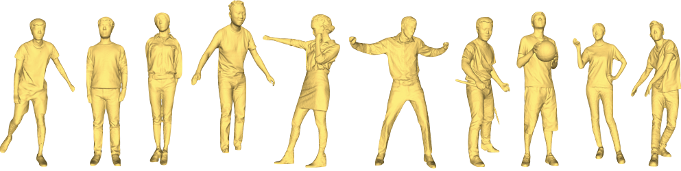
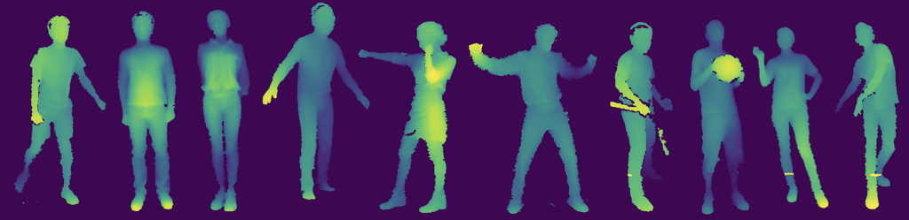

## Introduction

**Human10** is a real-world human body dataset, which contains 10 4D sequences of human actions and 10054 frames in total. 

For each frame, there are **depthmaps** and **masks** of 4 views along with corresponding **triangle meshs**. In addition, 4 fixed **camera calibration parameters** are provided in each sequence.


## Referencing the Dataset
Here are the Bibtex snippets for citing Human10 in your work.

```
@InProceedings{Cao_2018_ECCV,
  author = {Cao, Yan-Pei and Liu, Zheng-Ning and Kuang, Zheng-Fei and Kobbelt, Leif and Hu, Shi-Min},
  title = {Learning to Reconstruct High-quality 3D Shapes with Cascaded Fully Convolutional Networks},
  booktitle = {The European Conference on Computer Vision (ECCV)},
  month = {September},
  year = {2018}
}
```

## Contact us
